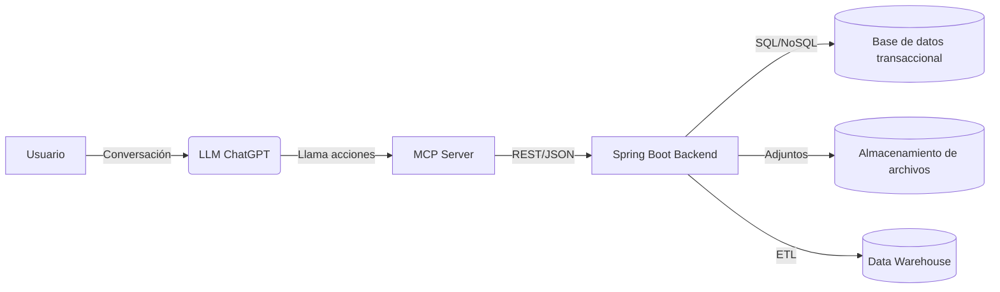
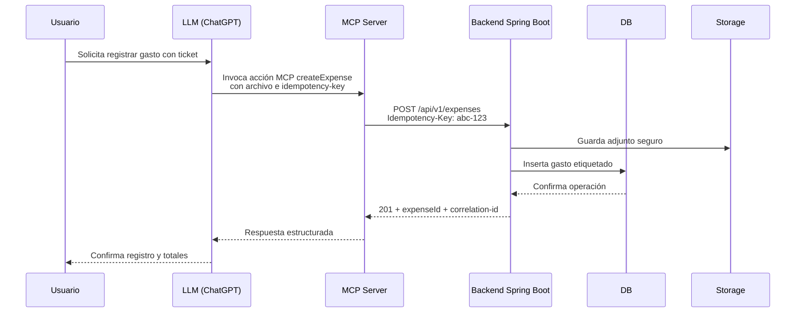

# Planifi: arquitectura end-to-end y estándares operativos

## 1. Contexto y objetivos

- **Alcance v0.1**: backend-first con **MCP Server** y API `/api/v1` para gastos,
  etiquetas y autenticación por API key.
- **Alcance v0.2**: hardening de seguridad, observabilidad básica y despliegue
  automatizado en un entorno gestionado.
- **Alcance v0.3**: e2e conversacional con adjuntos, reportes y optimización de
  costos.
- **Principios**: backend-first, contract-first (OpenAPI + MCP), security by
  design, privacidad por defecto, trazabilidad de decisiones (ADRs).

## 2. Arquitectura de alto nivel

## 3. Tecnologías por componente

- **MCP Server**: Node.js 20 + TypeScript + OpenAI MCP SDK; validación con Zod,
  clientes HTTP con undici e imagen distroless.
- **Gateway / Edge**: Kong Gateway o Nginx Ingress con rate limiting, auth de
  API keys, TLS y mTLS opcional hacia backend.
- **Backend**: Java 21 + Spring Boot 3.x con Spring MVC, Spring Data JPA,
  Spring Security, Resilience4j y Micrometer.
- **Base de datos transaccional**: PostgreSQL 16 para integridad ACID con
  particiones por tenant opcional.
- **Almacenamiento de adjuntos**: S3 compatible (S3, MinIO) con buckets
  privados, KMS, expiración y antivirus.
- **Almacenamiento documental**: MongoDB 7 (opcional) para adjuntos
  enriquecidos, auditoría y búsquedas flexibles.
- **Data Warehouse**: Snowflake o BigQuery para modelos analíticos y reportes
  con ingestión programada.
- **Mensajería / Outbox**: Kafka o RabbitMQ para eventos de dominio y
  proyección a DW con idempotencia.
- **Observabilidad**: OpenTelemetry, Prometheus, Grafana y Loki para trazas,
  métricas y logs estructurados.
- **CI/CD**: GitHub Actions o GitLab CI con Trivy, Snyk/Dependabot para lint,
  test, SAST, escaneo de contenedores y firma de imágenes.

## 4. Flujos clave (ejemplo createExpense)

## 5. MCP Server

- **Lenguaje**: Node.js 20 con TypeScript y **OpenAI MCP SDK**.
- **Acciones**: `createExpense`, `listExpenses`, `createTag`, `auth/api-key`.
- **Autenticación**: API key dedicada (`X-MCP-API-Key`) con rotación y scopes
  mínimos; mTLS opcional hacia el backend.
- **Validación**: esquemas Zod reutilizados desde contratos compartidos; todas
  las llamadas al backend incluyen **Idempotency-Key** y **correlation-id**.
- **Transporte**: HTTP/JSON sobre HTTPS; timeouts y retries exponenciales; uso
  de `Accept: application/json` y control de versiones en headers.
- **Observabilidad**: instrumentación OpenTelemetry (trazas + métricas de
  latencia y tasa de errores), logs JSON con `action` y `traceId`.
- **Empaquetado**: imagen distroless, usuario no-root, variables inyectadas por
  pipeline; despliegue como servicio stateless escalable horizontalmente.
- **Testing**: contrato MCP ↔ backend mediante mocks de API y suites de acciones
  conversacionales.

## 6. Backend Spring Boot

- **Tecnologías núcleo**: Java 21, Spring Boot 3.x, Spring MVC/WebFlux (según
  necesidad), Spring Data JPA con PostgreSQL, Spring Data Mongo para adjuntos,
  Flyway/Liquibase para migraciones, Resilience4j para resiliencia, Micrometer
  para métricas.
- **Capas**: controller (DTO + validación), service (dominio e idempotencia),
  domain (entidades), repository (JPA + Mongo template si aplica).
- **Persistencia**: PostgreSQL para operaciones críticas; MongoDB opcional para
  adjuntos enriquecidos y auditoría. Migraciones con Flyway/Liquibase.
- **Errores**: respuesta JSON estándar `{"errorCode","message","traceId"}` con
  `ProblemDetails` y mapeo centralizado.
- **Versionado**: prefijo `/api/v1` en rutas públicas; v2 rompe compatibilidad
  solo vía negociación de versión.
- **Idempotencia**: encabezado **Idempotency-Key** obligatorio en operaciones
  mutables. Claves se guardan en tabla `idempotency_keys` con `status`, `hash`
  y `response_body` para devolver resultados repetibles.

### 6.1 Montos y moneda
- **Decisión v0.1**: los montos se almacenan como **decimal** en PostgreSQL
  (`NUMERIC(14,2)`) y se representan en Java con `BigDecimal`.
- **Motivo**: precisión decimal adecuada para MXN y reportes financieros; evita
  errores de redondeo comunes en `float/double`.
- **Moneda por defecto**: `MXN` en tablas de cuentas; cualquier soporte
  multimoneda futuro deberá extender el modelo y los contratos.

## 7. Seguridad (obligatorio)

- **Authn/Authz**: JWT (usuarios finales) con scopes; API keys firmadas y
  rotables para el **MCP Server**. Roles mínimos: `mcp`, `user`, `admin`.
- **Secretos**: uso de vault gestionado, nunca en repos; variables de entorno
  inyectadas por pipeline.
- **OWASP Top 10**: validación de entrada, sanitización de logs, CSRF off en
  APIs tokenizadas, cabeceras de seguridad (HSTS, CSP, X-Content-Type-Options).
- **Rate limiting**: por API key y por IP; protección de fuerza bruta en login;
  circuit breakers y timeouts en integraciones.
- **Logging seguro**: sin PII sensible; usar `correlation-id` y `request-id`
  propagados desde gateway/MCP.
- **Hardening mínimo**:
  - Imágenes base distroless.
  - Run-as non-root y fs de solo lectura.
  - TLS 1.2+ extremo a extremo; mutual TLS opcional para MCP/backend.
  - Dependabot/Snyk activados para deps.
- **Checklist (mínimos)**:
  - [ ] Inventario de secretos en vault.
  - [ ] Política de rotación de API keys y JWT signing keys.
  - [ ] Rate limiting configurado en gateway y backend.
  - [ ] Revisiones SAST/DAST en pipeline.
  - [ ] Alertas de seguridad conectadas a on-call.
- **Backlog vinculado**: reforzar PLA-10 (requisitos v0.1) y PLA-13
  (estándares de API) con pruebas de abuso, rotación automática y límites por
  tenant.

## 8. SDLC y versionado

- **Branching**: trunk-based con ramas cortas `feature/PLA-XX`. Revisiones en
  PR obligatorias.
- **Versionado**: SemVer en backend; contratos MCP y OpenAPI versionados con
  tags `v1`. Releases etiquetados (`v0.1.0`, `v0.2.0`) y changelog.
- **Releases**: cortes semanales; hotfix vía `hotfix/*` con retroport a main.

## 9. CI/CD y calidad

- **Pipeline** (orden): lint (markdownlint, ktlint), tests unitarios, pruebas de
  contrato (OpenAPI + MCP schemas), integración, build container, SAST/dep
  scanning, firma de imagen, push a registry, despliegue a staging y luego
  prod con aprobación manual.
- **Quality gates**: cobertura mínima 80 %, cero vulnerabilidades críticas,
  builds reproducibles y signed images.
- **Pruebas**:
  - Unitarias: servicios y validaciones.
  - Integración: repositorios + REST con slices Spring.
  - E2E: flujos MCP conversacionales (createExpense, listExpenses, createTag,
    auth/api-key).

## 10. Operación y observabilidad

- **Logs**: JSON estructurado con `correlation-id`, `user-id` (hash), `api-key`
  (tokenizada), nivel y latencia.
- **Métricas**: Micrometer + Prometheus (latencias, errores, rate limit hit,
  idempotency reuse).
- **Trazas**: OpenTelemetry end-to-end (MCP ↔ backend ↔ DB/Storage).
- **Runbooks** mínimos:
  - Degradación de DB: failover, reducción de TTL de idempotency y colas.
  - Rotación de llaves: pasos para vault + despliegue coordinado.
  - Incidente de PII en logs: playbook de borrado y notificación.

## 11. Patrones y decisiones

- **Patrones**: DDD-lite; ports & adapters para integraciones de almacenamiento
  y proveedores de IA; CQRS opcional en reportes; Outbox para eventos
  confiables.
- **ADRs**: registrar decisiones de seguridad, almacenamiento, MCP-contract y
  autenticación con fecha y motivación. Referenciar a secciones de requisitos y
  a PLA-10/PLA-13 para trazabilidad.

## 12. Estándares de API

- **Idempotencia**: todas las operaciones POST/PUT/DELETE requieren
  Idempotency-Key y devuelven el mismo resultado ante reintentos.
- **Versionado**: `X-API-Version` opcional; rutas bajo `/api/v1`.
- **Errores**: formato único con `traceId` y `errorCode`; códigos HTTP estándar.
- **Contratos**: OpenAPI como fuente de verdad; generación de clientes; schemas
  MCP sincronizados con la API.

## 13. Backend scaffold v0.1 (PLA-52)

- **Capas**: `api` (controllers + DTO), `application` (servicios), `domain`
  (entidades y reglas), `infrastructure` (persistencia JPA/Mongo y adaptadores).
- **Dependencias base**: Spring Web, Validation, Security, Actuator, Data JPA,
  Data Mongo, Flyway, PostgreSQL driver, Micrometer tracing (OTel bridge) y
  SpringDoc (`/v3/api-docs` + Swagger UI).
- **Seguridad**:
  - API key por cabecera configurable (`X-API-Key` por defecto).
  - Endpoints abiertos: `/actuator/health`, `/actuator/info`, `/swagger-ui`,
    `/v3/api-docs/**`.
  - Perfil `test` desactiva el filtro de API key para pruebas.
- **Configuración por perfiles**:
  - `dev`: Postgres + Mongo locales (compose) con Flyway y `ddl-auto: validate`.
  - `test`: H2 en modo PostgreSQL con migraciones y seguridad deshabilitada.
  - `prod`: variables obligatorias (`SPRING_DATASOURCE_*`, `PLANIFI_SECURITY_*`,
    `SPRING_DATA_MONGODB_URI`), sin exponer detalles de salud.
- **Migraciones iniciales** (Flyway):
  - Tabla `expenses` (UUID, amount, occurred_on, description, created_at).
  - Tabla `idempotency_keys` para reintentos seguros en operaciones mutables.
- **OpenAPI**:
  - Bean central `OpenAPI` con título y licencia; Swagger UI en
    `/swagger-ui.html`.
  - Endpoints placeholder `/api/v1/expenses` listan/crean gastos con DTOs
    mínimos para alinearse al contrato MCP.
- **Contenedores**:
  - Dockerfile multi-stage (JDK para build, JRE para runtime).
  - `docker-compose.yml` levanta API, Postgres 16 y Mongo 7 con variables
    predeterminadas y puerto 8080 publicado.
- **Calidad**:
  - Smoke test con MockMvc valida `/actuator/health` y lista de gastos vacía.
  - `./mvnw test` usa perfil `test`; `npx markdownlint \"docs/**/*.md\"` cubre
    la documentación.
- **Trazabilidad**:
  - `docs/README.md` documenta setup local y variables.
  - Referencia a PLA-51/PLA-52 para mantener coherencia con arquitectura
    conversacional MCP-first.
