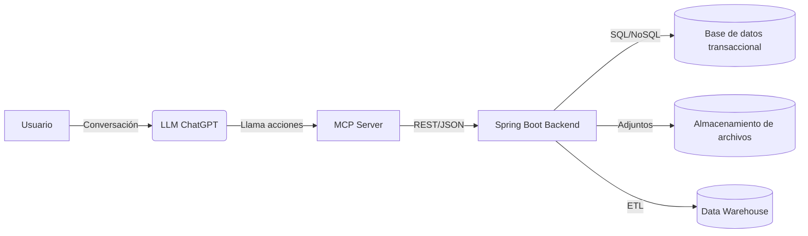
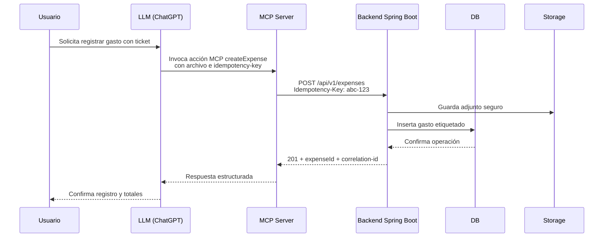

# Planifi: arquitectura end-to-end y estándares operativos

## 1. Contexto y objetivos

- **Alcance v0.1**: backend-first con **MCP Server** y API `/api/v1` para gastos,
  etiquetas y autenticación por API key.
- **Alcance v0.2**: hardening de seguridad, observabilidad básica y despliegue
  automatizado en un entorno gestionado.
- **Alcance v0.3**: e2e conversacional con adjuntos, reportes y optimización de
  costos.
- **Principios**: backend-first, contract-first (OpenAPI + MCP), security by
  design, privacidad por defecto, trazabilidad de decisiones (ADRs).

## 2. Arquitectura de alto nivel

## 3. Flujos clave (ejemplo createExpense)

## 4. Backend Spring Boot

- **Capas**: controller (DTO + validación), service (dominio e idempotencia),
  domain (entidades), repository (JPA + Mongo template si aplica).
- **Persistencia**: PostgreSQL para operaciones críticas; MongoDB opcional para
  adjuntos enriquecidos y auditoría. Migraciones con Flyway/Liquibase.
- **Errores**: respuesta JSON estándar `{"errorCode","message","traceId"}` con
  `ProblemDetails` y mapeo centralizado.
- **Versionado**: prefijo `/api/v1` en rutas públicas; v2 rompe compatibilidad
  solo vía negociación de versión.
- **Idempotencia**: encabezado **Idempotency-Key** obligatorio en operaciones
  mutables. Claves se guardan en tabla `idempotency_keys` con `status`, `hash`
  y `response_body` para devolver resultados repetibles.

## 5. Seguridad (obligatorio)

- **Authn/Authz**: JWT (usuarios finales) con scopes; API keys firmadas y
  rotables para el **MCP Server**. Roles mínimos: `mcp`, `user`, `admin`.
- **Secretos**: uso de vault gestionado, nunca en repos; variables de entorno
  inyectadas por pipeline.
- **OWASP Top 10**: validación de entrada, sanitización de logs, CSRF off en
  APIs tokenizadas, cabeceras de seguridad (HSTS, CSP, X-Content-Type-Options).
- **Rate limiting**: por API key y por IP; protección de fuerza bruta en login;
  circuit breakers y timeouts en integraciones.
- **Logging seguro**: sin PII sensible; usar `correlation-id` y `request-id`
  propagados desde gateway/MCP.
- **Hardening mínimo**:
  - Imágenes base distroless.
  - Run-as non-root y fs de solo lectura.
  - TLS 1.2+ extremo a extremo; mutual TLS opcional para MCP/backend.
  - Dependabot/Snyk activados para deps.
- **Checklist (mínimos)**:
  - [ ] Inventario de secretos en vault.
  - [ ] Política de rotación de API keys y JWT signing keys.
  - [ ] Rate limiting configurado en gateway y backend.
  - [ ] Revisiones SAST/DAST en pipeline.
  - [ ] Alertas de seguridad conectadas a on-call.
- **Backlog vinculado**: reforzar PLA-10 (requisitos v0.1) y PLA-13
  (estándares de API) con pruebas de abuso, rotación automática y límites por
  tenant.

## 6. SDLC y versionado

- **Branching**: trunk-based con ramas cortas `feature/PLA-XX`. Revisiones en
  PR obligatorias.
- **Versionado**: SemVer en backend; contratos MCP y OpenAPI versionados con
  tags `v1`. Releases etiquetados (`v0.1.0`, `v0.2.0`) y changelog.
- **Releases**: cortes semanales; hotfix vía `hotfix/*` con retroport a main.

## 7. CI/CD y calidad

- **Pipeline** (orden): lint (markdownlint, ktlint), tests unitarios, pruebas de
  contrato (OpenAPI + MCP schemas), integración, build container, SAST/dep
  scanning, firma de imagen, push a registry, despliegue a staging y luego
  prod con aprobación manual.
- **Quality gates**: cobertura mínima 80 %, cero vulnerabilidades críticas,
  builds reproducibles y signed images.
- **Pruebas**:
  - Unitarias: servicios y validaciones.
  - Integración: repositorios + REST con slices Spring.
  - E2E: flujos MCP conversacionales (createExpense, listExpenses, createTag,
    auth/api-key).

## 8. Operación y observabilidad

- **Logs**: JSON estructurado con `correlation-id`, `user-id` (hash), `api-key`
  (tokenizada), nivel y latencia.
- **Métricas**: Micrometer + Prometheus (latencias, errores, rate limit hit,
  idempotency reuse).
- **Trazas**: OpenTelemetry end-to-end (MCP ↔ backend ↔ DB/Storage).
- **Runbooks** mínimos:
  - Degradación de DB: failover, reducción de TTL de idempotency y colas.
  - Rotación de llaves: pasos para vault + despliegue coordinado.
  - Incidente de PII en logs: playbook de borrado y notificación.

## 9. Patrones y decisiones

- **Patrones**: DDD-lite; ports & adapters para integraciones de almacenamiento
  y proveedores de IA; CQRS opcional en reportes; Outbox para eventos
  confiables.
- **ADRs**: registrar decisiones de seguridad, almacenamiento, MCP-contract y
  autenticación con fecha y motivación. Referenciar a secciones de requisitos y
  a PLA-10/PLA-13 para trazabilidad.

## 10. Estándares de API

- **Idempotencia**: todas las operaciones POST/PUT/DELETE requieren
  Idempotency-Key y devuelven el mismo resultado ante reintentos.
- **Versionado**: `X-API-Version` opcional; rutas bajo `/api/v1`.
- **Errores**: formato único con `traceId` y `errorCode`; códigos HTTP estándar.
- **Contratos**: OpenAPI como fuente de verdad; generación de clientes; schemas
  MCP sincronizados con la API.
